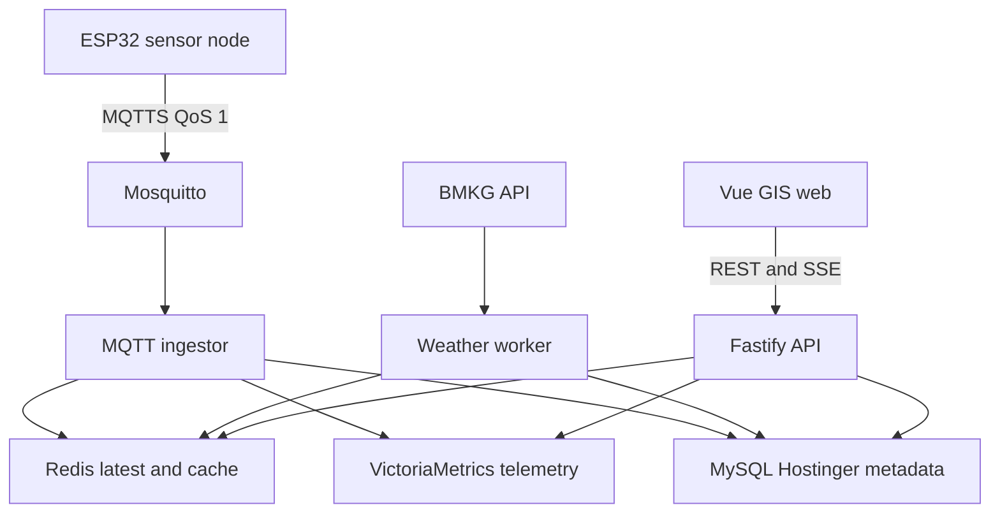

# 01 - System Overview

Status: Draft Fase 0  
Pemilik: PM, Backend Lead, Infra Lead

## Ringkasan Sistem

PAMILO Smart Farming GIS adalah platform pemantauan lahan pertanian multi-tenant. ESP32 mengirim telemetry sensor tanah lewat MQTT TLS, worker memvalidasi dan menyimpan data, backend menyajikan REST/SSE, dan frontend GIS menampilkan kondisi lahan, sensor, cuaca BMKG, alert, serta rekomendasi berbasis aturan.

## Identitas Awal

| Item | Nilai |
| --- | --- |
| Web production | `https://sedayafarm.keycloud.id` |
| MQTT production | `mqtts://mqtt.keycloud.id:8883` |
| IP publik VPS | `43.157.203.226` |
| Database control plane | MySQL Hostinger |
| Time-series telemetry | VictoriaMetrics single-node di VPS |
| Cache/latest | Redis di VPS |
| Broker | Eclipse Mosquitto |
| Frontend | Vue 3, TypeScript, Vite, Pinia, Leaflet |
| Backend | Node.js LTS, TypeScript, Fastify, Kysely/mysql2 |

## Prinsip Arsitektur

- Modular monolith untuk API, worker kecil terpisah untuk MQTT, BMKG, alert, dan rollup.
- Browser tidak boleh langsung mengakses MQTT, Redis, VictoriaMetrics, atau MySQL.
- `tenant_id` berasal dari identitas login, bukan parameter client.
- Device punya credential unik dan ACL topic paling sempit.
- Data telemetry berfrekuensi tinggi tidak ditulis satu per satu ke shared MySQL.
- Semua timestamp disimpan UTC; timezone farm hanya untuk presentasi.
- Data agronomy wajib punya provenance dan status review.

## Container View

## Alur Telemetry

1. ESP32 membaca sensor, memberi timestamp UTC, `seq`, dan quality flag.
2. ESP32 publish ke topic miliknya dengan MQTTS QoS 1.
3. Mosquitto memverifikasi username/client ID, TLS, dan ACL.
4. Ingestor validasi schema, ownership, replay, ukuran payload, timestamp, dan range.
5. Data valid ditulis batch ke VictoriaMetrics dan latest value ke Redis.
6. Status device dan `last_seen` dikirim ke MySQL secara debounce/batch.
7. API mengirim initial state lewat REST dan update ringan lewat SSE.

## Alur BMKG

1. Saat plot disimpan, backend menghitung centroid, bbox, area, dan mapping `adm4`.
2. Weather worker mengambil daftar `adm4` unik aktif.
3. Worker fetch ke BMKG per `adm4`, validasi response, dan normalisasi ke model internal.
4. Data disimpan ke Redis cache dan snapshot terkontrol.
5. Jika fetch gagal, UI menampilkan data terakhir dengan label stale.

## Source Facts Verified

- BMKG menyediakan prakiraan kelurahan/desa 3 hari, 8 data per hari, update 2 kali sehari, batas 60 request/menit/IP, endpoint `https://api.bmkg.go.id/publik/prakiraan-cuaca?adm4=...`, dan wajib atribusi BMKG. Diakses 2026-08-02: https://data.bmkg.go.id/prakiraan-cuaca/
- OSM tile server `tile.openstreetmap.org` bersifat best-effort tanpa SLA, wajib attribution, valid User-Agent/Referer, cache tiles, dan melarang bulk/offline download. Diakses 2026-08-02: https://operations.osmfoundation.org/policies/tiles/
- Hostinger Remote MySQL meminta IP host remote dan opsi Any Host akan membuat `%`. Diakses 2026-08-02: https://www.hostinger.com/support/1583546-how-to-set-up-remote-mysql-access-in-hostinger/
- VictoriaMetrics single-node default retention 1 bulan dan dapat diubah dengan `-retentionPeriod`. Diakses 2026-08-02: https://docs.victoriametrics.com/victoriametrics/single-server-victoriametrics/
