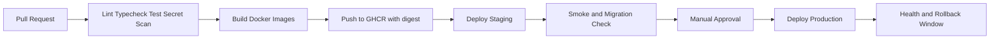

# 06 - DevOps Workplan

Status: Draft Fase 0  
Pemilik: DevOps Lead

## Misi DevOps

Membuat alur build, test, release, deployment, observability, rollback, dan audit release yang repeatable. Semua deployment harus memakai image immutable dan konfigurasi berbasis environment.

## Pipeline Target



## CI Checks

- Format check.
- Lint.
- Typecheck.
- Unit test.
- Integration test.
- API schema compatibility.
- MQTT payload schema test.
- Tenant isolation negative test.
- Secret scan.
- Docker image build.
- SBOM/vulnerability scan jika tool tersedia.

## Docker Standards

- Satu `docker-compose.yml` untuk local baseline.
- Compose override untuk staging/production.
- Semua service punya healthcheck.
- Semua image dipin oleh tag release dan digest.
- Environment memakai placeholder di repo; secret dari secret manager atau CI secret.
- Network dipisah: `edge`, `app`, `data`.
- Log rotation wajib untuk semua container.

## Release Rules

- Release dari branch protected.
- Migration dijalankan sebagai step eksplisit dan idempotent.
- Changelog mencatat image digest, migration ID, operator, waktu, dan rollback target.
- Production deploy memakai approval.
- Rollback memakai image digest terakhir yang sudah sehat.

## GitHub Actions VPS Access

- Data non-sensitif seperti `VPS_HOST`, `VPS_PORT`, dan `VPS_USERNAME` boleh memakai repository variables.
- Credential seperti password, token, dan deploy key idealnya memakai repository secrets; workflow VPS saat ini membaca `VPS_PASSWORD` dari secret atau fallback variable sesuai konfigurasi existing.
- Akses VPS untuk Fase 1 hanya berupa workflow manual read-only connectivity check.
- Akses VPS untuk Fase 8 memakai workflow manual `Staging Deploy` dengan username/password sesuai konfigurasi existing; workflow ini tidak membutuhkan private key.
- Deployment production belum boleh dibuat sebelum deployment readiness dan security gate disetujui.
- Lihat `docs/15-github-actions-vps-access.md` untuk setup aman.

## Commands Fase 8 Staging

Artifact staging Fase 8 tersedia di `infra/staging/compose.staging.yaml` dan dijalankan oleh workflow manual `.github/workflows/staging-deploy.yml`. Perintah operasional di VPS memakai folder deploy staging:

```text
cd /opt/pamilo/staging
docker compose --env-file staging.env -f compose.staging.yaml pull
docker compose --env-file staging.env -f compose.staging.yaml up -d --remove-orphans
docker compose --env-file staging.env -f compose.staging.yaml ps
docker compose --env-file staging.env -f compose.staging.yaml logs --tail=200 api
```

Jangan menjalankan command production dari dokumen ini sebelum gate production disetujui.

Smoke staging dari runner atau mesin operator:

```text
PAMILO_BASE_URL=http://<staging-host>:8080 npm run smoke:staging
```

## Deliverables per Fase

| Fase | Deliverable DevOps |
| --- | --- |
| 1 | CI awal, Docker skeleton, env template |
| 2 | Test DB/migration pipeline |
| 4 | MQTT integration test workflow |
| 5 | Telemetry load test job |
| 7 | Secret scan, SBOM/scan, staging gate |
| 8 | Deploy staging, rollback rehearsal. Status awal ada di `docs/22-phase-8-staging-deployment.md` |
| 10 | Production release workflow dan release notes |

## Acceptance Criteria DevOps

- PR tidak bisa merge jika checks wajib gagal.
- Image production tidak dibangun langsung di VPS.
- Release bisa diulang dengan input yang sama.
- Rollback berhasil diuji di staging.
- Healthcheck menjadi syarat deploy sukses.
- Tidak ada secret di log CI.

## Source Facts Verified

- Docker Compose mendukung deklarasi services, networks, volumes, dan healthcheck pada compose file. Diakses 2026-08-02: https://docs.docker.com/reference/compose-file/services/
